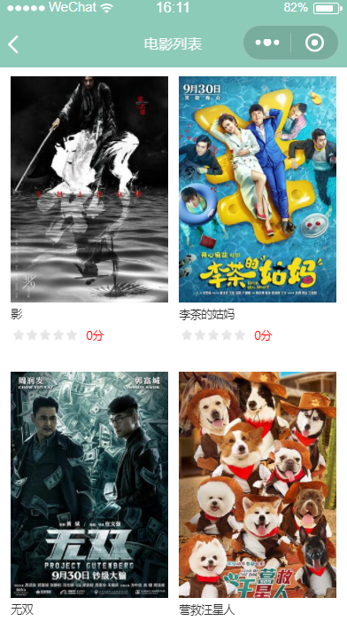

# 电影预告微信小程序

> 该小程序主要利用豆瓣接口，实现了一个电影预告小程序，该小程序主要包括个人中心，搜索，首页三大模块，小程序主要实现了电影详情，评分，浏览记录，以及下拉无限加载，demoUI主要参考[微信官网][https://developers.weixin.qq.com/miniprogram/dev/api/]   实现，小程序如有错误，欢迎指正,下载学习~

* 首页

* 详情页

* 电影列表

* 个人中心

* 评分

* 搜索页

* 电影列表

* 评分

